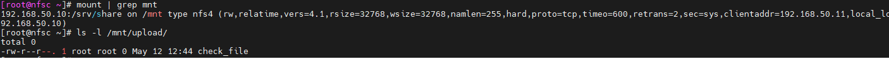
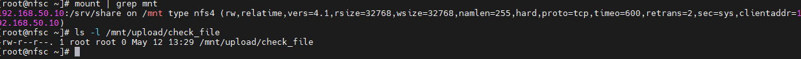

# NFS
1. Были проделаны действия как описаны в методичке. **Vagrant up** поднимает 2 виртуальные машины. Далее коммандами все настраивалось. в итоге делаем проверку: на сервере  ``` touch /srv/share/upload/check_file ``` создаем проверочный файл в директории и потом заходим на клиента и в примонтированной папке этот файл должны увидеть, что и произошло.
2. 
3. Далее создаем 2 bash-скрипта  **nfss_script.sh** и **nfsc_script.sh**  для автоматическогог разворачивания 2-х машин с настроенным **nfs**
4. и после выполнения комманды **vagrant up** так же делаем проверку : на сервере  ``` touch /srv/share/upload/check_file ```
5. 
6. Как видно на скрине- все работает.
7. В репозитории итоговый vagrantfile.
   
